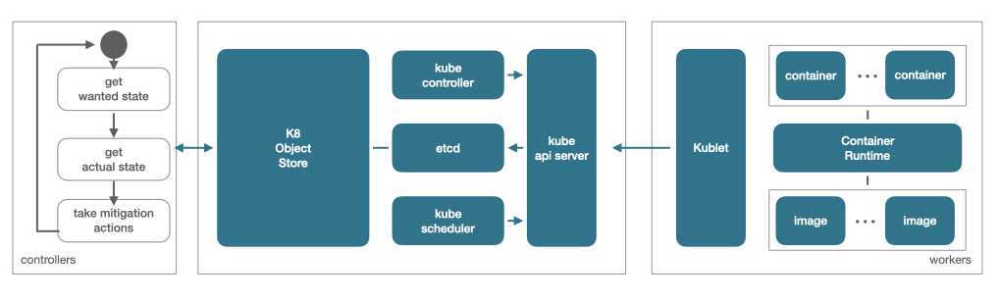
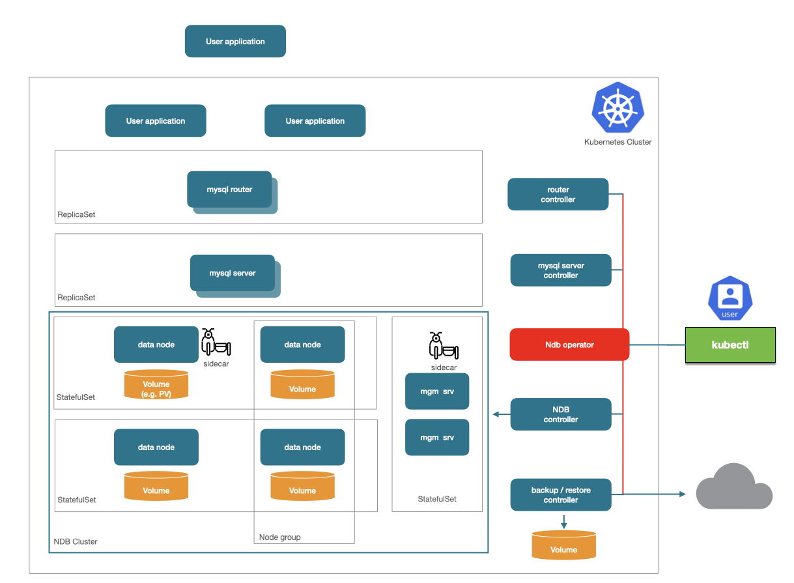
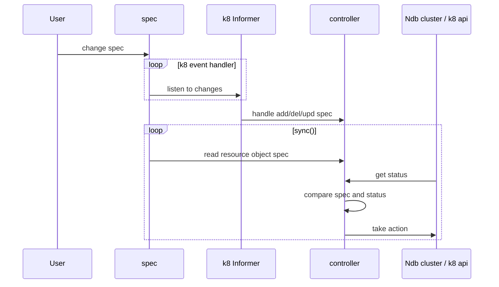

# Requirements

## Operator capability levels 

Further reading with a detailed description of [operator capability levels](https://sdk.operatorframework.io/docs/advanced-topics/operator-capabilities/operator-capabilities/).

Level 1 -  Basic Install: automated application provisioning and configuration management
            Cassandra, CouchDB, YugaBytes

Level 2 - Seamless Upgrades: patch and minor version upgrades supported
            PostgreSQL Operator (Openlabs), Redis, HazelCast

Level 3 - Full Lifecycle: App lifecycle, storage lifecycle (backup/recovery)
            Elastic Cloud on Kubernetes (ElasticSearch), PostgreSQL Operator (by Zalando  and by Dev4Ddevs), etcd (CoreOS, archieved)

Level 4 - Deep Insights: Metrics, alerts, log processing and workload analysis
            MongoDB (by MongoDB and by Percona), MariaDB

Level 5 - Auto Pilot: Horizontal/vertical scaling, auto config tuning, abnormal detection, scheduling tuning
            CouchBase, PostgreSQL (by Crunchy Data)

# Goals

- Ship some basic Level 1 first
- then iterate with updates

List in [opertorhub.io](https://operatorhub.io/operator/?category=Database)?

- Aim for a level 5, but level 3 is good already

Rely as much as possible on k8 features

- rolling restarts
- status objects
- probes

ignore (in the beginning) incomplete k8 features such as 
- etcd not being the perfect backend for leader elections or object status
- k8 object store not acid e.g. when changing multiple objcts or listing pods

## Best practices

[Operator framework best practices](https://github.com/operator-framework/community-operators/blob/master/docs/best-practices.md)

[Google cloud best practices](https://cloud.google.com/blog/products/containers-kubernetes/best-practices-for-building-kubernetes-operators-and-stateful-apps)

## Features

- Cluster life-cycle
  - provisioning
  - scaling
  - upgrade
  - config changes
  - auto-recovery
- Cluster configuration
- MySQL Server certificate set-up
- Persistent volumes
- Pod-affinity and anti-affinity
- Resource management
- Server groups
- Backup and restore
- Prometheus monitoring

## Advanced mysqld features

- TLS and certificate rotation
- User and group management (mysqld)
- Cross data center replication via mysqld

## 3rd Party

Openshift

## License

Apache?

# Architecture

## Kubernetes 



## Ndb Operator



## CustomResourceDefinition

Complete cluster configuration with parameters in 
one CRD or two CRDs (ndb + mysqld layers) possible.

## Deployment

Operator can run outside (mostly testing) and inside the kubernetes cluster.

## Components

StatefulSets for data nodes and managent server
- one per ndb replica (?)
- one for both management servers

ReplicaSets for mysqld
- separate simple operator even?

## Controllers

A controller reads the desidered state and takes actions based on the actual state. 

- management servers 
- data node (one per ndb replica?)
- backup and restore
- mysqld  

### Cluster spec and status

A user describes the new desired Ndb cluster state and topology by changing the spec of the Ndb CRD.

In order to enable the controller to take action based on the new spec it subscribes to object change events from the Ndb CRD and other resources.

These change events are placed in a (rate limited) workqueue and then
processed in a sync() loop which reads the resources new spec describing the desired state and compares with the actual status.

Rate limited workqueues are used and automatically collapse quick following changes into a single change.

Based on the difference between the desired and actual state action will be taken.



Each controller must be able to crash and fail over (leader re-election) without corrupting cluster or operator state. 

NDB needs to be able to run without the operator running. A cluster created with the operator should at any point in time be manageable by the operator 
again (unless someone has interacted with the cluster manually and changed fundamental aspects of the installation).

### Idempotency 

Due to how we need to survive operator crashes and failovers and the fact that we have a declarative API approach the operator has to be idempotent.

### Status information

Certain status information will need to be stored in kubernetes objects' status. However, whenever possible the actual cluster state should be extraced from NDB itself rather than via object status.

## Images

docker vs k8 images? Leave docker images as-is and just base new k8 images on the existing ones? Replace with "hybrid" images for both worlds? Two separate images?

Could use [Multi-architecture images](https://kubernetes.io/docs/concepts/containers/images/#multi-architecture-images-with-manifests) but that seems to be rather hardware architecture related?

Standard docker image lacks

- a way create to "inject" a config ini or information about the environment (hosts, etc.)
- an additional agent for ndb_mgmd, on e.g. a different container on the same pod could 
  not start or restart ndb_mgmd as direct process interaction is necessary. 
  Also lack of something like an angel for ndb_mgmd.
  
Standard image will still be used. ndb_mgmd will be started with a config from a generated config map. 
Restarts are done by restarting the pod. 

# ndb nodes, operators and containers/pod

Each ndb node and operator runs in its own container inside its own pod.
A pod can consist of a ndb node and an agent sidecar pod. 

Operators can run inside a pod or outside.

Nodes run in --foreground and --nodaemon inside their container. A failed process will thus lead to a pod- or container restart. How about management server here?

# readiness

StatefulSets rely on pod readiness states for managing 
rolling restarts. 

Readiness probes - can have additional [readinessGates](https://kubernetes.io/docs/concepts/workloads/pods/pod-lifecycle/#pod-readiness-gate) for each pod defined. 

The ndb operator needs to retrieve cluster state as well in order to 
avoid undesired maintainence operations (e.g. avoid triggering 
restart of one pod while all other nodes of node group are down)

# stop, start and restarts

Nodes shall whenever possible be stopped by either stopping the ndb nodes and not the container/pod it is running in.

SfSets: 
  - rolling restart if any property changed
  - parallel if set
  - partitioned & parallel - probably not possible

Pods: 
  - don't restart if property changed, done via SfSet

container termination with SIGNAL - node shutdown shutdown is graceful within period

Conflicts between k8 and ndb with its advanced failure handling and self-healing?

Before restarting a pod or perform a rolling / parallel restart of statefulsets via k8 ndb cluster state needs to be carefully checked.

## rolling restarts

Rolling restarts will be performed by triggering a node (re-)start via MGMAPI. Pod state needs to be considered to avoid outages. PDB could be checked and guide rolling restarts to also stay in line with k8.

At the moment scale down is not supported. But Scaling down is tricky as here k8 will scale down number of pods while also MGMAPI could try to stop nodes. In this case graceful shutdown is less important. Data nodes can be scaled down by k8 as hopefully data nodes are re-organized and drained first.

## pod disruption budgets (PDB)

Budgets for pods can be defined based on labels. 

Unfortunately budgets are only considered when using the [Eviction API](https://kubernetes.io/docs/tasks/administer-cluster/safely-drain-node/#eviction-api). Eviction API is only used on node level when e.g. draining nodes. 

The Eviction API could be used via client API and pod Eviction subresources for policy-controlled pod deletion. We are not doing that. At least not in a first step.

kubectl delete pod or scaling a statefulset does not evaluate budgets.

Using PDBs is still useful as an extra level of security in the larger context of a production setup to avoid  unwanted outages when e.g. nodes are drained.

## start and state monitoring

Starts should be monitored and controlled by timestamp to take action when starts might hang. 

## ndb_mgmd

unline ndbmtd ndb_mgmd has no -n mode to wait and take e.g. a remote start command
thus we wrap ndb_mgmd into an agent for that purpose

The management server probably needs a small wrapper 
agent running inside its container in the first versions until 
we fixed ndb_mgmd to start and stop remotely. 
This could be part of the standard docker image as well.

config changes require a re-write or patching of the configuration
Both management servers need to be in stopped state in parallel for a moment to reload a new config version from the ini file. (How can we achieve that with very "agressive" k8 pod restarts?)


# multiple sidecars / operators 

multiple operators will decide over [leaderelection](https://kubernetes.io/blog/2016/01/simple-leader-election-with-kubernetes/) via [k8 api](k8s.io/client-go/tools/leaderelection)
  
  not tested yet

according to [jepsen](https://jepsen.io/analyses/etcd-3.4.3) leader leases have a HA problem though as they are stored in etcd

More on this in a [blog about K8 HA](https://medium.com/@dominik.tornow/kubernetes-high-availability-d2c9cbbdd864)


# deploy 

## Install Custom Resource Definitions, ServiceAccounts, ClusterRoles, and ClusterRoleBindings

```bash
kubectl -n ${NAMESPACE} apply -f artifacts/manifests/crd.yaml
sed -e "s/<NAMESPACE>/${NAMESPACE}/g" artifacts/manifests/rbac.yaml | kubectl -n ${NAMESPACE} apply -f -
```

## Create NDB Object of kind Ndb 

Applying or deleting a CRD of kind Ndb will deploy a new cluster setup or delete an existing.

## Deleting NDB Object

Ideally all components have owner references and will be garbage 
collected automatically when Ndb is deleted.

## Configuration

The entire cluster configuration can be done via the Ndb object. Most of the normal standard config shall be available there (such as LockPages ...). Optionally (is this simpler in first step?) a ConfigMap can provide a classic ini file which will be merged with the configuration parts coming from the Ndb CRD object

There is also a tension between topology parameters and other config parameters when mixing "classic" config.ini configuration and mixing it with k8 operator configuration. A classic config.ini configuration carries information about e.g. the amount of memory to use but also about the number of nodes. 

Decision: no external configuration via config.ini, environment variables or ConfigMap. All configuration for cluster comes from the Ndb object described via yaml.

Possible example

```
spec:
  ndbd:
    nodes: 2
    reduncancy: 2  
    datamemory: 2GB
    transactionmemory: 200MB
    sharedglobalmemory: 100MB
    volumeClaimTemplate:
      metadata:
        name: data
      spec:
        storageClassName: manual
        accessModes:
          - ReadWriteMany
        resources:
          requests:
            storage: 1Gi
  mgmd:
    nodes: 2
  mysqld:
    replicas: 12
    sslSecret:
      name: mysql-ssl-secret
    
```

Ideally cluster configures itself based on configured resource limitations.

# Config changes and scaling 

In order to handle config changes data nodes and management nodes need to be restarted. Driving ndb to the new config across multiple pods and statefulsets requires to keep track of the desired configuration and the actual config state in cluster.

One solution is to use each configuration's unique "fingerprint" by e.g. calculating the hash and timestamp of the generated config.ini. 

A more detailed solution could be to compare the desired config with the actual configuration of each data node via ndbinfo. 

Once the ndb controller observes a new configuration the configuration's fingerprint will be updated in the annotation section of the Ndb CRD object. 

This fingerprint will be compared with the fingerprint stored in the Ndb object's status.

As soon as each stateful set fully restarted with the new configuration then the configuration's finger print will be updated in the Ndb object's status. 

## config injection

While handing over of configuration to kubernetes via objects and specs is obviously no problem there is no natural oberlap with how ndb handles initial configuration and configuraiton changes.

[Presets](https://kubernetes.io/docs/tasks/inject-data-application/podpreset/) or environment variables can inject configuration into a container or pod *only at creation time*. Injecting information at runtime is only possible via e.g. network, IPC or maybe shared volumes. 

ConfigMaps can be changed at pod runtime but may take some time to synchronize (observed in minikube > 30secs). 

Ndb operator re-creates the mgmd pods every time the config changes to be sure to pick up the latest version. 

## config versioning

Cluster allows a "manual" `ConfigGenerationNumber` in the system section on the cluster config 
this number could be used to track if a generation was rolled out to mgmd and data nodes 

## pod whoami

How to know which pod one is own? Injecting ENV variables.

https://kubernetes.io/docs/tasks/inject-data-application/environment-variable-expose-pod-information/

```
apiVersion: v1
kind: Pod
metadata:
  name: test
spec:
  containers:
    - name: test-container
      env:
        - name: MY_NODE_NAME
          valueFrom:
            fieldRef:
              fieldPath: spec.nodeName
```


# Logging

Log aggregation? 

fluentd
logstash
OCI logging framework


